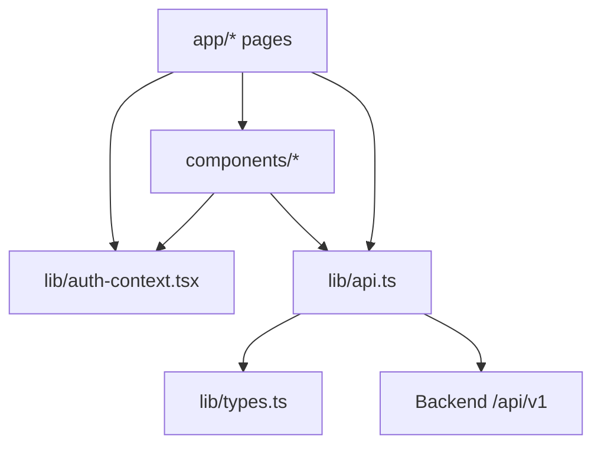
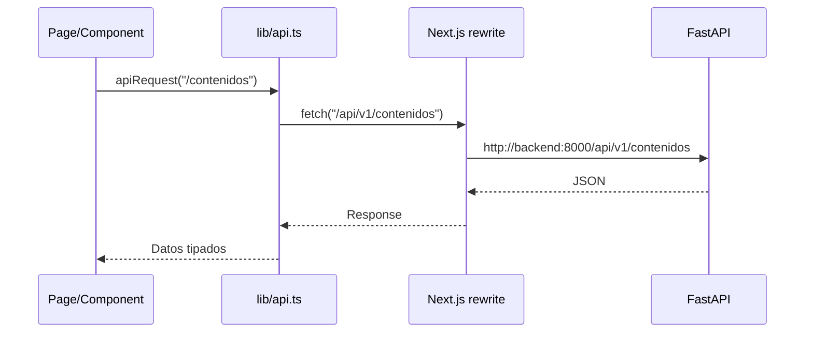
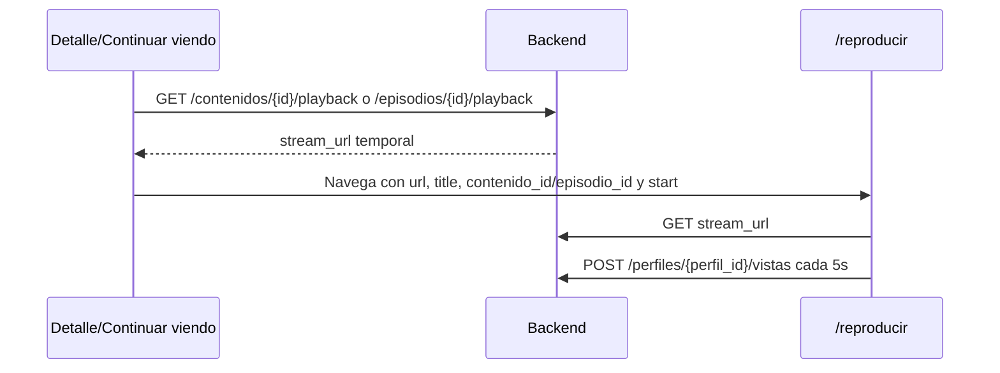

# Frontend Titoflix

Frontend de Titoflix construido con Next.js App Router, React, TypeScript y Tailwind CSS. Implementa login/registro, seleccion de perfiles, navegacion de catalogo, detalle de contenido, reproduccion, progreso de visualizacion, Mi lista y consola administrativa.

## Responsabilidades

| Responsabilidad  | Detalle                                                                                |
|------------------|----------------------------------------------------------------------------------------|
| UI de usuario    | Renderiza login, perfiles, home, busqueda, detalle y reproductor.                      |
| UI admin         | Permite gestionar generos, contenidos, temporadas, episodios, uploads y test playback. |
| Estado de sesion | Guarda JWT, cuenta y perfil activo en `localStorage`.                                  |
| API              | Consume el backend mediante `lib/api.ts` y rutas relativas `/api/v1`.                  |
| Proxy            | Usa rewrites de Next.js para llegar al backend desde la red interna de Docker.         |
| Playback         | Reproduce videos usando URLs temporales entregadas por `/playback`.                    |
| Progreso         | Reporta segundos vistos periodicamente a `/perfiles/{perfil_id}/vistas`.               |

## Dependencias

| Dependencia                     | Uso                                    |
|---------------------------------|----------------------------------------|
| `next` 16                       | App Router, routing, build y rewrites. |
| `react` 19 / `react-dom`        | UI.                                    |
| `typescript`                    | Tipado.                                |
| `tailwindcss` 4                 | Estilos.                               |
| `lucide-react`                  | Iconos.                                |
| `eslint` / `eslint-config-next` | Lint.                                  |

## Scripts

| Script  | Comando      | Uso                           |
|---------|--------------|-------------------------------|
| `dev`   | `next dev`   | Servidor local de desarrollo. |
| `build` | `next build` | Build de produccion.          |
| `start` | `next start` | Sirve build de produccion.    |
| `lint`  | `eslint`     | Ejecuta lint.                 |

## Estructura

```text
frontend/
|-- app/
|   |-- layout.tsx              # Root layout y AuthProvider
|   |-- page.tsx                # Redireccion segun auth/perfil/admin
|   |-- login/page.tsx          # Login, registro y acceso admin
|   |-- admin/page.tsx          # Consola admin
|   |-- perfiles/page.tsx       # Selector de perfiles
|   |-- perfiles/crear/page.tsx # Creacion de perfil
|   |-- reproducir/page.tsx     # Reproductor con reporte de progreso
|   `-- (browse)/
|       |-- layout.tsx           # Layout de navegacion autenticada
|       |-- inicio/page.tsx
|       |-- peliculas/page.tsx
|       |-- series/page.tsx
|       |-- buscar/page.tsx
|       |-- mi-lista/page.tsx
|       `-- contenido/[id]/page.tsx
|-- components/
|   |-- AdminDashboard.tsx
|   |-- BrowseHeader.tsx
|   |-- ContentCard.tsx
|   |-- ContentDetail.tsx
|   |-- ContentRow.tsx
|   |-- ContinuarViendoRow.tsx
|   |-- Header.tsx
|   |-- Hero.tsx
|   |-- ProfileSelector.tsx
|   `-- VideoPlayer.tsx
|-- lib/
|   |-- api.ts                  # Cliente API, tokens y helpers de URLs
|   |-- auth-context.tsx        # Estado global de auth/perfil
|   `-- types.ts                # Tipos compartidos del frontend
|-- public/
|-- Dockerfile
|-- next.config.ts
`-- package.json
```

## Arquitectura interna



## Comunicacion con backend

El frontend usa `lib/api.ts` como cliente central.



`next.config.ts` define:

```ts
source: "/api/v1/:path*"
destination: `${INTERNAL_BACKEND_URL}/api/v1/:path*`
```

Esto permite que el navegador llame al mismo host del frontend mientras el contenedor de Next.js habla con el backend por la red interna de Docker.

## Variables de entorno

| Variable                      | Default                                   | Uso                                                         |
|-------------------------------|-------------------------------------------|-------------------------------------------------------------|
| `INTERNAL_BACKEND_URL`        | `http://backend:8000` en `next.config.ts` | Destino interno de rewrites `/api/v1`.                      |
| `NEXT_PUBLIC_API_URL`         | `/api/v1`                                 | Base URL usada por `apiRequest`.                            |
| `NEXT_PUBLIC_DIRECT_API_URL`  | `/api/v1`                                 | Base alternativa expuesta por `getDirectApiUrl`.            |
| `NEXT_PUBLIC_BACKEND_URL`     | vacio                                     | Prefijo opcional para URLs de stream relativas.             |
| `NEXT_PUBLIC_MAX_UPLOAD_SIZE` | `10485760`                                | Limite cliente para uploads controlados, por defecto 10 MB. |

## Estado de autenticacion

`lib/auth-context.tsx` expone:

| Campo/funcion            | Uso                                     |
|--------------------------|-----------------------------------------|
| `account`                | Cuenta autenticada actual.              |
| `profile`                | Perfil seleccionado.                    |
| `isAuthenticated`        | Estado derivado del token y cuenta.     |
| `isLoading`              | Carga inicial/refresco de cuenta.       |
| `login(account)`         | Guarda cuenta en estado y localStorage. |
| `selectProfile(profile)` | Selecciona perfil activo.               |
| `logout()`               | Borra token, cuenta y perfil.           |
| `refreshAccount()`       | Consulta `/auth/me`.                    |

Claves de `localStorage` usadas en `lib/api.ts`:

| Clave              | Contenido                |
|--------------------|--------------------------|
| `titoflix_token`   | JWT de cuenta.           |
| `titoflix_account` | Datos basicos de cuenta. |
| `titoflix_profile` | Perfil seleccionado.     |

## Flujo de navegacion

```mermaid
flowchart TD
    Root[/ app/page.tsx /]
    Login[/login]
    Admin[/admin]
    Profiles[/perfiles]
    Browse[/inicio]

    Root -->|Sin token| Login
    Root -->|Cuenta admin| Admin
    Root -->|Cuenta normal sin perfil| Profiles
    Root -->|Cuenta normal con perfil| Browse
```

## Rutas principales

| Ruta              | Funcion                                                                    |
|-------------------|----------------------------------------------------------------------------|
| `/login`          | Login, registro, seleccion de plan y acceso admin.                         |
| `/admin`          | Consola para generos, contenidos, temporadas, episodios y test playback.   |
| `/perfiles`       | Seleccion de perfil.                                                       |
| `/perfiles/crear` | Alta de perfil con avatar/PIN opcional.                                    |
| `/inicio`         | Home autenticado con filas de contenido, top, Mi lista y continuar viendo. |
| `/peliculas`      | Listado filtrado de peliculas.                                             |
| `/series`         | Listado filtrado de series.                                                |
| `/buscar`         | Busqueda por texto, genero, tipo y orden.                                  |
| `/mi-lista`       | Contenidos guardados por perfil.                                           |
| `/contenido/[id]` | Detalle, temporadas, episodios, calidades y acciones.                      |
| `/reproducir`     | Reproductor fullscreen con reporte de progreso.                            |

## Componentes principales

| Componente                | Responsabilidad                                                                          |
|---------------------------|------------------------------------------------------------------------------------------|
| `AdminDashboard`          | Consola CRUD de generos, contenidos, temporadas, episodios, upload y playback de prueba. |
| `BrowseHeader` / `Header` | Navegacion, selector de perfil, acciones de cuenta y logout.                             |
| `ContentCard`             | Tarjeta de contenido.                                                                    |
| `ContentRow`              | Fila horizontal de contenidos.                                                           |
| `ContentDetail`           | Detalle de pelicula/serie, episodios, Mi lista y reproduccion.                           |
| `ContinuarViendoRow`      | Fila de progreso guardado por perfil.                                                    |
| `Hero`                    | Contenido destacado en home.                                                             |
| `ProfileSelector`         | Seleccion de perfiles por cuenta.                                                        |
| `ProfileCreateScreen`     | Creacion de perfiles.                                                                    |
| `VideoPlayer`             | Reproductor embebible con controles basicos.                                             |

## Cliente API

Funciones destacadas de `lib/api.ts`:

| Funcion/constante              | Uso                                                                 |
|--------------------------------|---------------------------------------------------------------------|
| `apiRequest<T>(path, options)` | Fetch central con auth, JSON/form-data, errores y limite de upload. |
| `getApiUrl(path)`              | Construye URL usando `NEXT_PUBLIC_API_URL`.                         |
| `getDirectApiUrl(path)`        | Construye URL usando `NEXT_PUBLIC_DIRECT_API_URL`.                  |
| `getBackendUrl(path)`          | Resuelve URLs de stream relativas o absolutas.                      |
| `getAssetUrl(path)`            | Convierte keys `assets/...` en `/api/v1/assets/...`.                |
| `getAuthHeaders()`             | Agrega `Authorization: Bearer <token>`.                             |
| `register()`                   | Crea cuenta en `/cuentas/`.                                         |
| `reportarVista()`              | Reporta progreso a `/perfiles/{id}/vistas`.                         |
| `logout()`                     | Borra token, cuenta y perfil local.                                 |
| `MAX_UPLOAD_SIZE`              | Limite configurable de upload cliente.                              |

## Flujo de reproduccion



En `app/reproducir/page.tsx`:

| Constante                 | Valor | Uso                                |
|---------------------------|-------|------------------------------------|
| `REPORT_INTERVAL_SECONDS` | `5`   | Frecuencia de reporte de progreso. |
| `TERMINADO_THRESHOLD`     | `0.9` | Marca terminado al superar 90%.    |

Tambien se reporta progreso en `pause`, navegacion atras y cierre de pestana como best effort.

## Uploads desde admin

| Recurso   | Endpoint                   | Formato               | Reglas                                               |
|-----------|----------------------------|-----------------------|------------------------------------------------------|
| Genero    | `POST /generos?nombre=...` | Query param           | Requiere admin.                                      |
| Pelicula  | `POST /contenidos`         | `multipart/form-data` | Requiere video; puede incluir portada.               |
| Serie     | `POST /contenidos`         | `multipart/form-data` | No lleva video directo; episodios cargan video.      |
| Temporada | `POST /temporadas`         | JSON                  | Pertenece a una serie.                               |
| Episodio  | `POST /episodios`          | `multipart/form-data` | Requiere video; backend genera duracion y thumbnail. |

## Instalacion local

```bash
cd frontend
npm install
npm run dev
```

Tambien existe `pnpm-lock.yaml` y el Dockerfile usa pnpm via Corepack:

```bash
cd frontend
pnpm install
pnpm dev
```

Abrir `http://localhost:3000`.

Para produccion local:

```bash
npm run build
npm run start
```

## Ejemplos de uso interno

Consulta de contenidos:

```ts
const contenidos = await apiRequest<Contenido[]>("/contenidos");
```

Login:

```ts
const response = await apiRequest<AuthResponse>("/auth/login", {
  method: "POST",
  body: JSON.stringify({ email, password }),
});
```

Upload de contenido:

```ts
const form = new FormData();
form.append("titulo", "Demo");
form.append("tipo", "pelicula");
form.append("anio", "2026");
form.append("clasificacion_edad", "+13");
form.append("generos_ids", "1");
form.append("video", file);

const created = await apiRequest<Contenido>("/contenidos", {
  method: "POST",
  body: form,
});
```

## Mantenimiento

| Cambio deseado              | Archivos principales                                    |
|-----------------------------|---------------------------------------------------------|
| Nueva pagina                | `app/` siguiendo App Router.                            |
| Nuevo componente reusable   | `components/` y tipos de props.                         |
| Nuevo endpoint reutilizable | `lib/api.ts`.                                           |
| Nuevo tipo de backend       | `lib/types.ts`.                                         |
| Cambio de rutas API         | `next.config.ts`, `lib/api.ts` y llamadas `apiRequest`. |
| Cambio de auth              | `auth-context.tsx` y helpers de `api.ts`.               |
| Verificar lint              | `npm run lint`.                                         |
| Verificar build             | `npm run build`.                                        |
